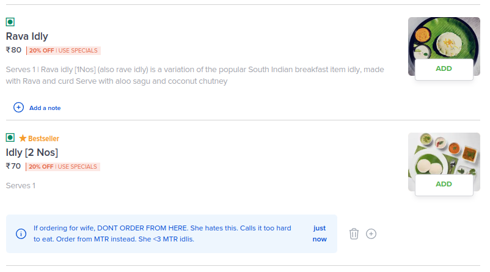
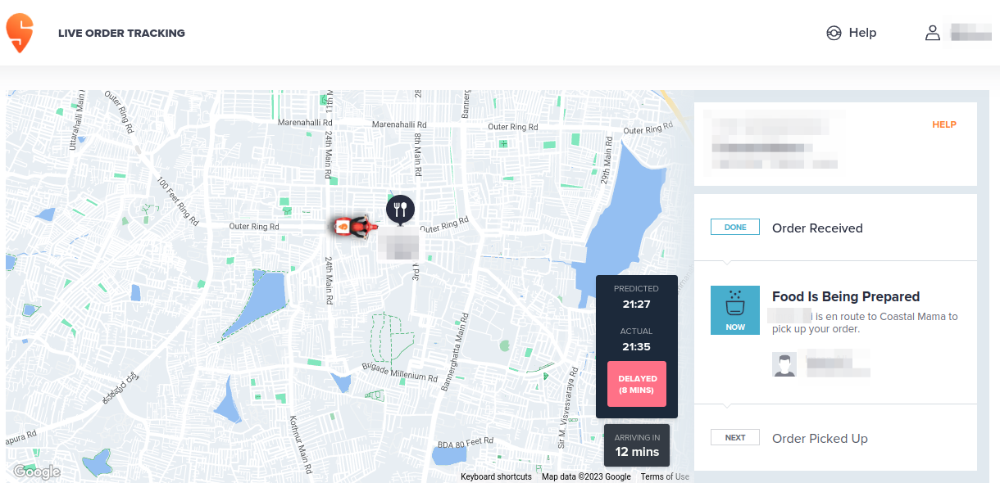

# Swee - Chrome Extension for Enhanced Swiggy Experience


Swee is a Chrome extension that enhances your Swiggy experience by allowing you to add notes to food items from various restaurants and track the delivery time in real-time. With Swee, you can make informed decisions about your future orders and stay updated on your delivery's progress.

## Features

### 1. Food Notes

Swee enables you to add personal notes to food items from different restaurants. This feature helps you keep track of which dishes you liked, disliked, or want to try again. 



To use Food Notes:
1. [Install the Swee Chrome extension.](#installation)
2. Navigate to the Swiggy website and select a restaurant.
3. Against each food item, you should see a notes section, allowing you to view any existing notes and add new notes.
4. In the new note panel, you can enter and save notes for individual food items.
5. Further, in the Order Again section, you will also see an indicator informing you of any existing notes on the items, which when clicked, scrolls the page to the detailed food item section where you can view the note

**No data is shared with any server. Your notes are stored within your browser itself.**

### 2. Delivery Tracker

Swee provides a real-time delivery tracker that monitors the promised delivery time and the estimated delivery time. This feature helps you gauge if the delivery is on schedule or running behind.



To use the Delivery Tracker:
1. [Install the Swee Chrome extension.](#installation)
2. Place an order on Swiggy.
3. Once the payment goes through and you are on the delivery tracking page, you should see the delivery time as mentioned by Swiggy. When this happens, you should see a secondary delivery tracker on top of it.
4. The Delivery Tracker will display the promised delivery time and the current estimated delivery time

## Installation

To install Swee on your local development environment, follow these steps:

1. Clone this repository:

  ```bash
  $ git clone https://github.com/callmekatootie/swee.git
  ```

2. Navigate to the `swee` directory and install [pnpm](https://pnpm.io/installation)
3. Install dependencies - `$ pnpm install`
4. You can now run the extension in [development mode](https://docs.plasmo.com/framework/workflows/dev) or [production mode](https://docs.plasmo.com/framework/workflows/build).

**(You can also use npm instead of pnpm)**

## Contributing

We welcome contributions from other developers to improve Swee. Feel free to fork this repository, make changes, and submit pull requests.

## License

This project is licensed under the MIT License.

## Feedback and Support

If you encounter any issues, have suggestions, or need support, please create an issue in the [GitHub repository](https://github.com/callmekatootie/swee/issues).

### Why is this not publised to the Chrome store?

This is a hobby project and a demonstration of my skills more than anything else.

---

Happy Swiggy ordering with Swee! 🍔🍕🚀
